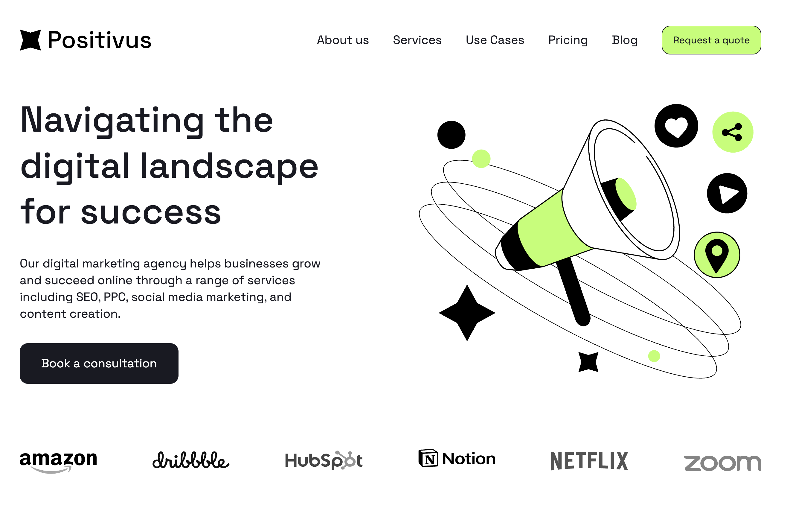
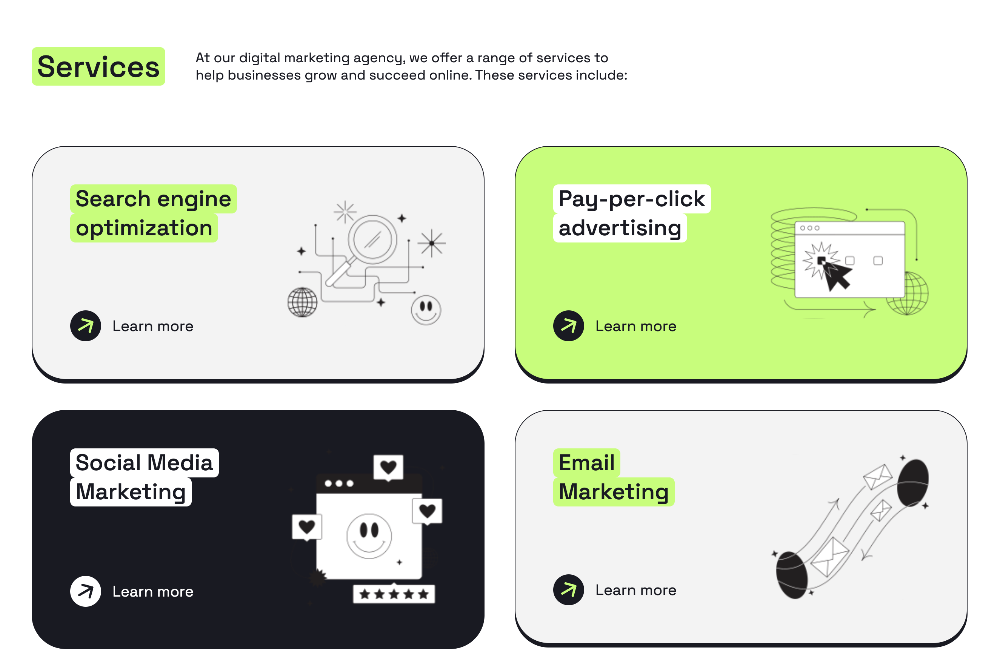
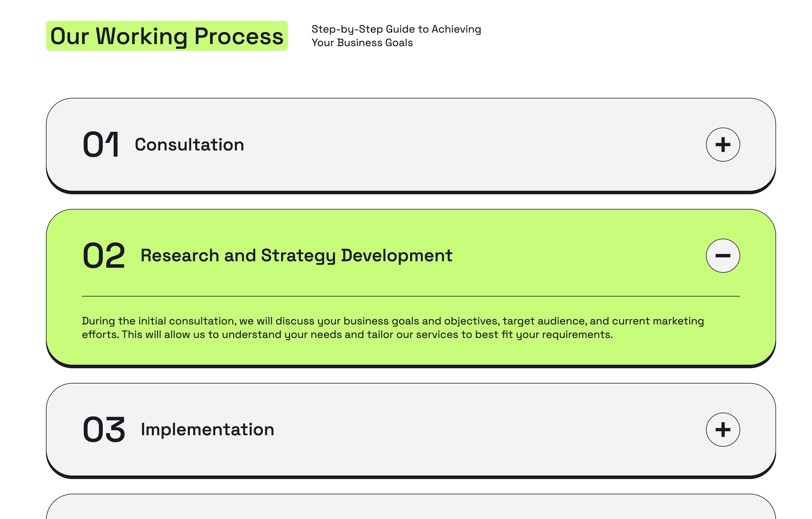
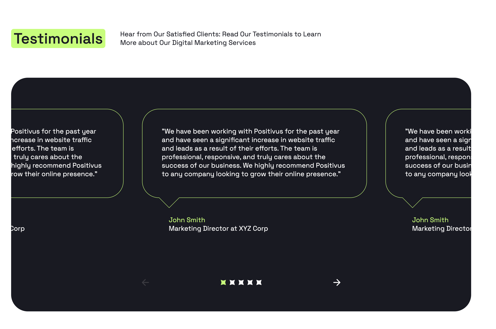
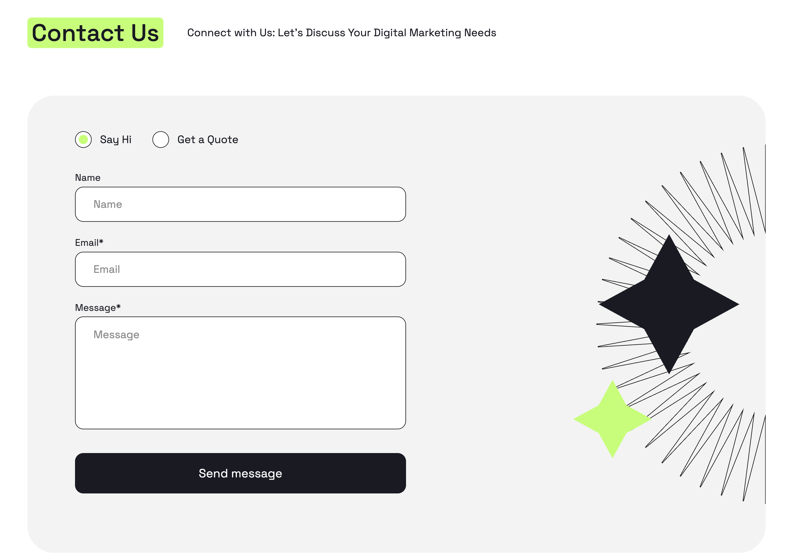
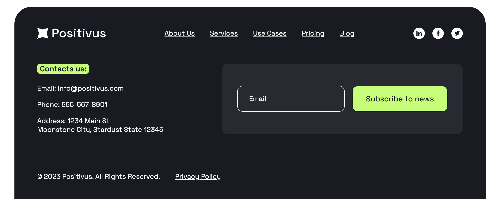

# Positivus —  лендинг для маркетингового агентства

**Positivus** — это лендинг, созданный в рамках учебного проекта. Целью было разработать современный, адаптивный и визуально привлекательный интерфейс для вымышленного digital-маркетингового агентства.

## 🔍 Описание проекта

Сайт представляет собой лендинг, включающий все ключевые блоки:  
- Главный экран с CTA
- Блок с услугами  
- Кейсы (реалистичные примеры проектов)  
- Этапы работы  
- Команда специалистов  
- Контактная форма  

Проект сверстан с нуля без использования фреймворков, только на **HTML5** и **CSS3** с использованием препроцессора стилей **Sass**

## 🚀 Что было реализовано

- Семантическая и структурированная HTML-разметка  
- Кастомные адаптивные сетки на CSS Grid  
- Интерактивные элементы (бургер-меню, аккордеоны)  
- Компонентный подход к оформлению карточек и секций  
- Полная адаптивность под мобильные и десктопные экраны  
- Использование кастомных CSS-переменных и темизации  
- Подключение кастомных шрифтов (`Space Grotesk`)  
- Проработка hover/active-состояний  
- Разметка с учётом доступности (aria, visually-hidden и др.)

## 🛠 Использованные технологии

- HTML5  
- CSS3
- Sass (SCSS) (миксины, переменные, функции)
- CSS Grid и Flexbox  
- Адаптивный дизайн (media queries)  
- БЭМ-нотация в классах  
- Шрифты в формате WOFF2  
- Простая модульная структура проекта

## 🧠 Полученные навыки

В процессе работы были отработаны и закреплены следующие навыки:

- Верстка по макету/дизайн-системе  
- Работа с современными возможностями CSS (переменные, кастомизация компонентов, responsive typography)  
- Повышение доступности сайта  
- Создание интерактивных компонентов без JavaScript (например, аккордеоны на `
`)  
- Оптимизация изображений и lazy loading  
- Основы организации стилей и компонентов в проектах

## 📸 Превью

